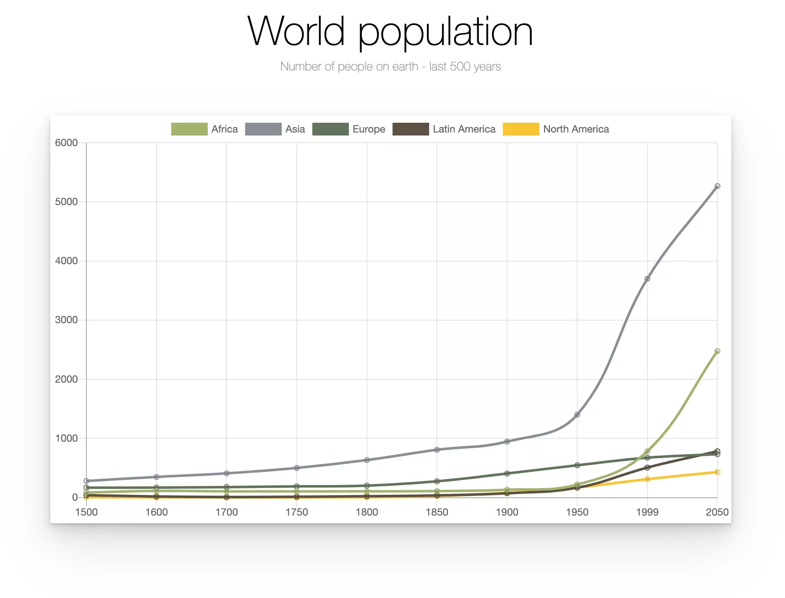
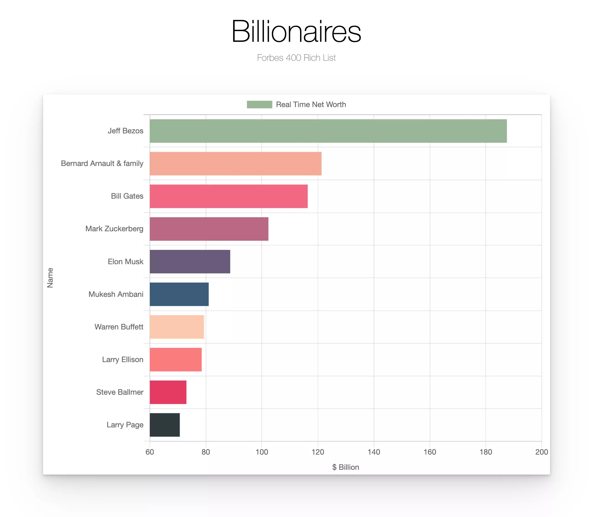

## Data visualization projects 
###### - work in progress

*  Using data source in JS
*  Using API data source with real-time fetch

#### Tech used: 
- JavaScript
- Chart.js
- React
- CSS
- Lottie
- Postman
- VS Code
- Chrome

## View it live
https://display-data.netlify.app/

